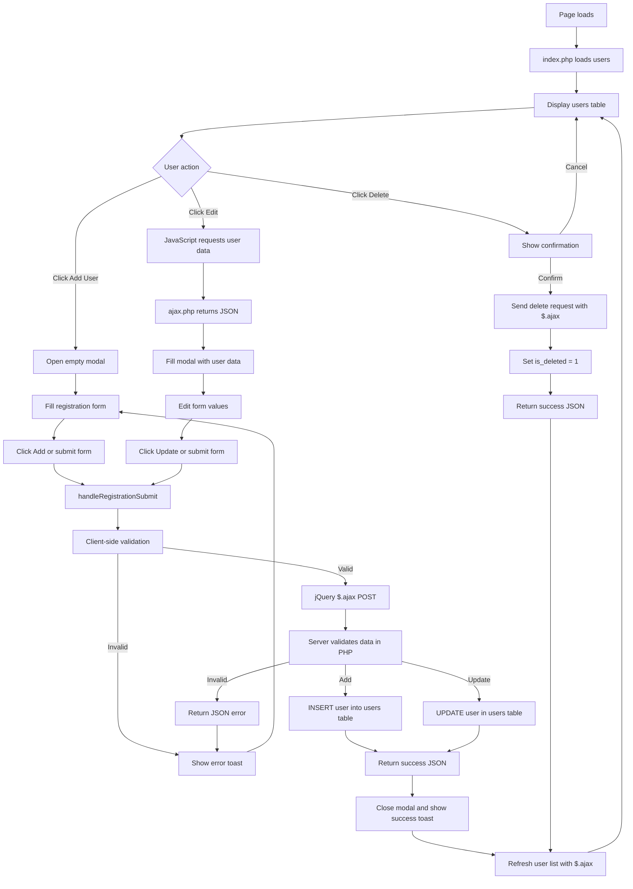
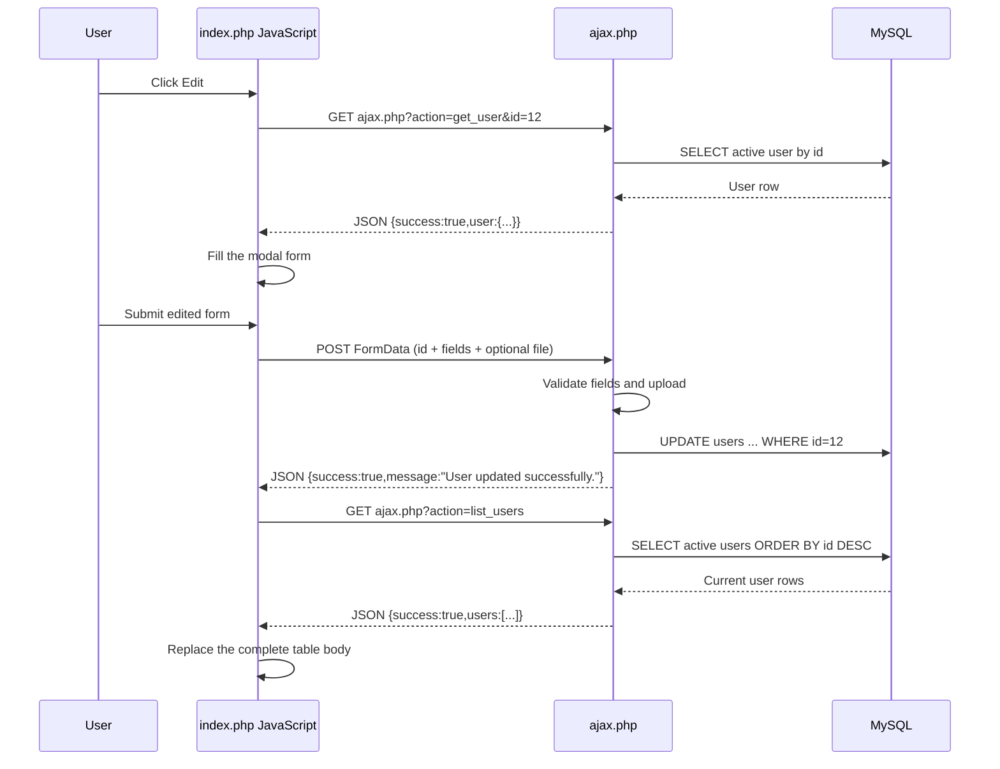

# Learning for PHP

A simple PHP and MySQL user-listing application demonstrating CRUD operations.

## Features

- Create users with name, email, gender, status, password, and profile picture
- Read and display active users from MySQL
- Edit users in an in-page modal
- Soft delete users using the `is_deleted` flag
- JavaScript and PHP validation
- Prepared MySQL statements
- JPG and PNG uploads up to 1 MB
- Same-page success messages and delete toast

## Requirements

- XAMPP
- Apache
- MySQL
- PHP 8 or later

## Setup

1. Copy this project into:

   ```text
   /Applications/XAMPP/xamppfiles/htdocs/Learning_for_php
   ```

2. Start **Apache** and **MySQL** in XAMPP.

3. Open phpMyAdmin at:

   ```text
   http://localhost/phpmyadmin
   ```

4. Select the existing `User listing` database.

5. Run the migration statements in `database.sql`.

6. Make sure the `uploads` directory exists and is writable by Apache.

7. Open the application:

   ```text
   http://localhost/Learning_for_php/index.php
   ```

## Database

The application uses the `users` table with these important fields:

- `id`: primary key
- `full_name`: user name
- `email_id`: user email
- `gender`: `M`, `F`, or `O`
- `password`: password value
- `status`: `1` for active or `0` for inactive
- `profile_picture`: uploaded image path
- `is_deleted`: `0` for visible or `1` for soft-deleted

`database.sql` contains migrations for the existing table. It does not create a new database or table.

## Project Files

- `index.php`: registration form, user list, JavaScript validation, edit modal, and AJAX calls
- `ajax.php`: JSON API for listing, reading, adding, editing, and soft-deleting users
- `connection.php`: MySQL connection and image-upload helper
- `database.sql`: database migrations
- `uploads/`: uploaded profile pictures

## AJAX Workflow

`index.php` uses `ajax.php` as the single JSON endpoint. The page initially renders the table with PHP, and JavaScript refreshes the complete table after every successful add, edit, or delete.

### Complete User Management Workflow





### 1. Opening the edit form

Each row has an `.edit-user-button` containing the user ID. The delegated click handler creates this request:

```text
GET ajax.php?action=get_user&id=12
```

`ajax.php` validates the ID, queries a non-deleted user, and returns:

```json
{
   "success": true,
   "user": {
      "id": 12,
      "full_name": "Example User",
      "email_id": "user@example.com",
      "gender": "M",
      "status": 1,
      "profile_picture": "uploads/example.jpg"
   }
}
```

The browser reads `data.user`, puts its values into the modal inputs, sets `form-mode` to edit, and shows the modal. The password fields remain blank because a password is never returned by the API.

### 2. Adding or editing a user

When the modal is submitted, JavaScript first performs client-side validation. If it passes, `event.preventDefault()` stops a normal page navigation and jQuery `$.ajax()` sends a `POST` request to `ajax.php` with `new FormData(form)`.

- No `id` means add mode.
- An `id` means edit mode.
- `action` is omitted, so `ajax.php` treats the request as save.
- The file input is included in the multipart `FormData` request.

The API validates the request again on the server. It inserts a new row in add mode or updates the existing row in edit mode. Success returns JSON such as:

```json
{"success":true,"message":"User updated successfully."}
```

Validation failures return HTTP `422` with `success: false`, a combined `message`, and an `errors` array. The browser displays the message in the error toast.

### 3. Refreshing the complete table

After a successful save, the browser calls:

```text
GET ajax.php?action=list_users
```

The API selects every user where `is_deleted = 0`, ordered by newest ID first, and returns:

```json
{"success":true,"users":[{"id":12,"full_name":"Example User"}]}
```

`refreshUsers()` converts that array into table rows and replaces the entire `#users-tbody` HTML. This keeps the table synchronized with the database instead of changing only the row that was edited.

### 4. Deleting a user

The delete form sends a separate POST request with an explicit action:

```text
POST ajax.php
action=delete&id=12
```

`ajax.php` checks that the user exists, then performs a soft delete by setting `is_deleted = 1`. It returns:

```json
{"success":true,"message":"User deleted successfully."}
```

The browser then calls the same `list_users` endpoint and replaces the complete table body. The deleted row disappears because it is no longer returned by the `is_deleted = 0` query.

## Password Warning

The current code temporarily stores passwords as plain text because password hashing was removed during development. Before using this project outside local testing, restore password hashing with:

```php
$hashedPassword = password_hash($password, PASSWORD_DEFAULT);
```

Store `$hashedPassword` instead of `$password` in the database.

## Validation

PHP syntax can be checked with:

```bash
php -l index.php
php -l ajax.php
php -l edit.php
php -l ajax.php
php -l connection.php
```
